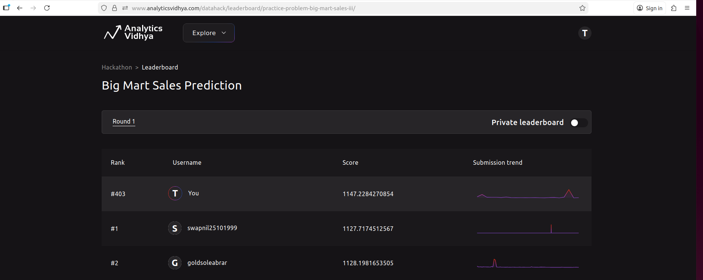
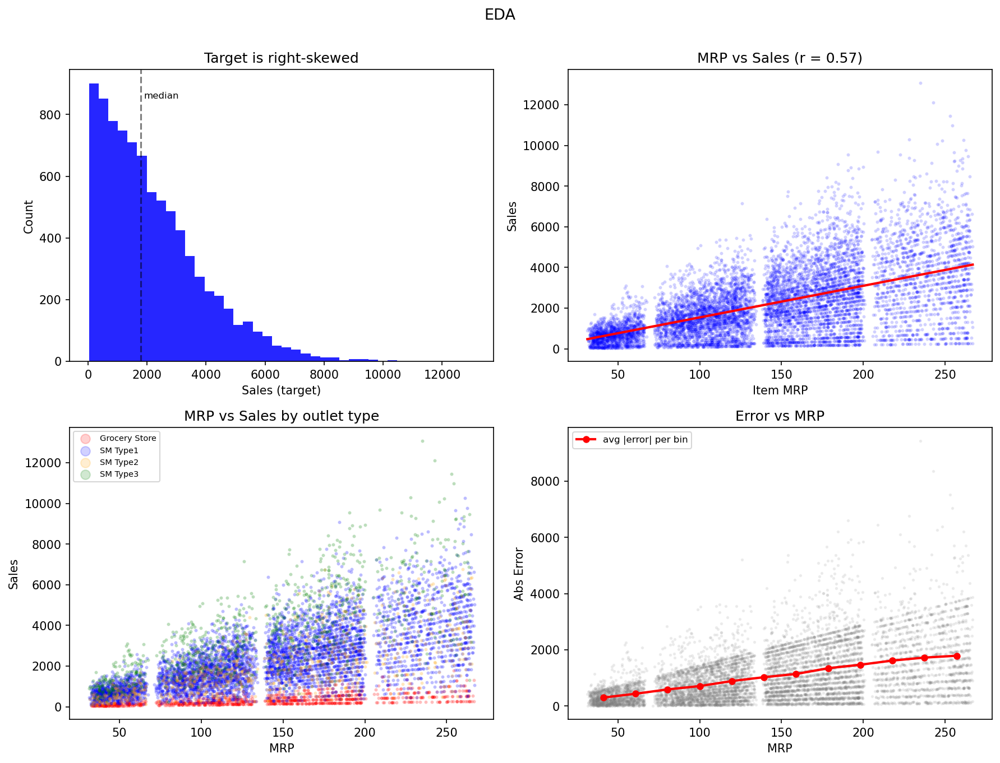

# BigMart Sales Prediction

Stacking ensemble approach for the Analytics Vidhya BigMart Sales. **Rank 403** on the leaderboard.



## Data Exploration

8523 training rows, 5681 test rows, 11 features + 1 target (`Item_Outlet_Sales`).

Key findings:
- The **Item_MRP** is the strongest predictor (correlation 0.57 with sales). The relationship is roughly linear (top-right shows regression line) but with high variance at higher MRP values.
- The **Outlet_Type** is the second most important factor. Grocery stores average 340 sales vs supermarkets at ~2300-3700.
- The **MRP x Outlet_Type interaction** is the real driver: same MRP product sells very differently across outlet types (bottom-left).
- Most other features (Item_Weight, Item_Visibility, Outlet_Size) have weak or no direct correlation with sales.
- The sales distribution is right-skewed and positive-valued (top-left), with variance scaling proportionally to mean (heteroscedastic).



**Error observations**: Absolute prediction errors grow with MRP (bottom-right). A product of MRP 250 has ~3x the absolute error of one of MRP 50, even though the relative error (~30%) is similar across all MRP ranges. This means RMSE is dominated by high-MRP items.

## Data Cleaning

- Fixed inconsistent `Item_Fat_Content` labels ("low fat", "LF" -> "Low Fat", "reg" -> "Regular")
- Imputed missing `Item_Weight` with mean per product identifier, fallback to global median (1463 nulls)
- Imputed missing `Outlet_Size` with mode per outlet type (2410 nulls)
- Replaced zero `Item_Visibility` values with mean per item type
- Created `Item_Type_Broad` from identifier prefix (FD=Food, DR=Drinks, NC=Non-Consumable)
- Created MRP x Outlet_Type interaction features (one per outlet type)
- K-fold target encoding for `Outlet_Sales_Per_MRP` and `Item_Sales_Mean` (5-fold, to prevent leakage)

## Approach

First tested standard models individually, then combined them through stacking.

**Models tested (standalone cross validation RMSE)**:
- Ridge regression (linear): 1130
- LightGBM: 1090
- CatBoost: 1095
- ExtraTrees: 1110
- XGBoost: 1095

Above models can be classified as linear (ridge), vs non linear (rest), and non linear models as well can be classified as boosted trees (LightGBM, Catboost) vs bagged trees (ExtraTrees).

**Stacking ensemble**: train each model using 5-fold cross-validation to get out-of-fold predictions, then use a Ridge meta-learner to find the optimal weighted combination. This reduced RMSE from 1090 (best single model) to 1072 (stacked).

**Loss functions**: Sales variance scales with mean hence switched from MSE to Tweedie loss for LGB (p=1.7) and CatBoost (p=1.8). Tweedie assumes `Var(Y) ~ E[Y]^p`, which naturally handles the heteroscedasticity and gives appropriate gradient signals for high-MRP items.

**Seed averaging**: ran the full pipeline with 3 different random seeds and averaged the final predictions to reduce variance. This was done to check whether performance was affected just by using different seeds.

## Final Model

4-model stack with Ridge meta-learner, averaged across 3 seeds:
- **LightGBM** (Tweedie loss, 600 trees, depth 8)
- **CatBoost** (Tweedie loss, 320 iterations, depth 6, native categorical handling)
- **ExtraTrees** (1000 trees, depth 8, random splits for diversity)
- **Ridge** (linear regression on scaled features, captures the strong linear MRP-sales relationship)

All parameters initially assumed, but since computation was minimum due to small dataset, brute force hyperparameter tuning done for best results.

Meta-learner weights (seed 42): LGB=0.36, CB=0.35, ET=-0.35, Ridge=0.66

The ridge has highest weight because the MRP-sales relationship is linear. ExtraTrees gets negative weight. 

**Cross validation RMSE: 1071.70** | **Leaderboard Rank: 403**

## Files

| File | Description |
|---|---|
| `final_submission.py` | Final model: 4-model stacking ensemble |
| `eda.py` | Exploratory data analysis script |
| `requirements.txt` | Python dependencies |

## Setup

Download the dataset from the [Analytics Vidhya BigMart Sales III](https://datahack.analyticsvidhya.com/contest/practice-problem-big-mart-sales-iii/) competition page.

```bash
pip install -r requirements.txt
```

## Usage

```bash
# EDA (generates eda_plots.png)
python eda.py <train.csv>

# Train + predict (generates submission.csv)
python final_submission.py <train.csv> <test.csv>
```

## What Did Not Work

- Adding XGBoost to the stack (got zero weight with Ridge meta-learner)
- Dense network (no improvement on this small tabular dataset)
- Polynomial features for Ridge (Idea was to build up on the linear relationship, improved cross validation but worse on leaderboard)
- Additional feature engineering: outlet age, MRP price tiers, frequency encoding, cross target-encoding (all hurt)
- Log-transforming the target (to ensure higher MRP are given more importanvce, failed, Tweedie loss handles skewness better)
